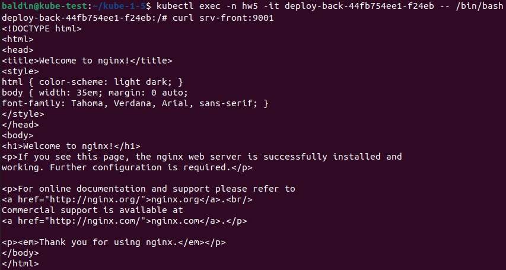
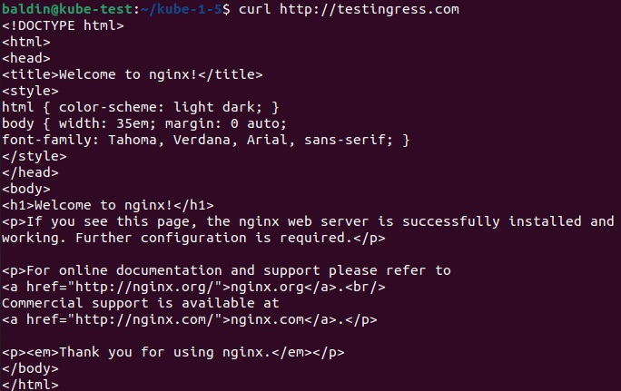
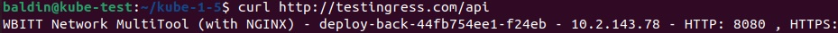

# Домашнее задание к занятию «Сетевое взаимодействие в K8S. Часть 2» - Балдин

### Цель задания

В тестовой среде Kubernetes необходимо обеспечить доступ к двум приложениям снаружи кластера по разным путям.

------

### Чеклист готовности к домашнему заданию

1. Установленное k8s-решение (например, MicroK8S).
2. Установленный локальный kubectl.
3. Редактор YAML-файлов с подключённым Git-репозиторием.

------

### Инструменты и дополнительные материалы, которые пригодятся для выполнения задания

1. [Инструкция](https://microk8s.io/docs/getting-started) по установке MicroK8S.
2. [Описание](https://kubernetes.io/docs/concepts/services-networking/service/) Service.
3. [Описание](https://kubernetes.io/docs/concepts/services-networking/ingress/) Ingress.
4. [Описание](https://github.com/wbitt/Network-MultiTool) Multitool.

------

### Задание 1. Создать Deployment приложений backend и frontend

1. Создать Deployment приложения _frontend_ из образа nginx с количеством реплик 3 шт.

Манифест Deployment Frontend:

```yaml
apiVersion: apps/v1
kind: Deployment
metadata:
  name: deploy-front
  namespace: hw5
  labels:
    app: nginx-front
spec:
  selector:
    matchLabels:
      app: nginx-front
  replicas: 3
  template:
    metadata:
      labels:
        app: nginx-front
    spec:
      containers:
      - name: nginx
        image: nginx:1.20
        ports:
        - containerPort: 80
```

2. Создать Deployment приложения _backend_ из образа multitool. 

```yaml
apiVersion: apps/v1
kind: Deployment
metadata:
  name: deploy-back
  namespace: hw5
  labels:
    app: multitool-back
spec:
  selector:
    matchLabels:
      app: multitool-back
  replicas: 1
  template:
    metadata:
      labels:
        app: multitool-back
    spec:
      containers:
      - name: multitool
        image: wbitt/network-multitool
        ports:
        - containerPort: 8080
        env: 
          - name: HTTP_PORT
            value: "8080"
```

3. Добавить Service, которые обеспечат доступ к обоим приложениям внутри кластера. 

```yaml
apiVersion: v1
kind: Service
metadata:
  name: srv-front
  namespace: hw5
spec:
  selector:
    app: nginx-front
  ports:
    - name: nginx
      port: 9001
      targetPort: 80
```

```yaml
apiVersion: v1
kind: Service
metadata:
  name: srv-back
  namespace: hw5
spec:
  selector:
    app: multitool-back
  ports:
    - name: miltitool
      port: 9002
      targetPort: 8080
```

4. Продемонстрировать, что приложения видят друг друга с помощью Service.
5. Предоставить манифесты Deployment и Service в решении, а также скриншоты или вывод команды п.4.



------

### Задание 2. Создать Ingress и обеспечить доступ к приложениям снаружи кластера

1. Включить Ingress-controller в MicroK8S.
2. Создать Ingress, обеспечивающий доступ снаружи по IP-адресу кластера MicroK8S так, чтобы при запросе только по адресу открывался _frontend_ а при добавлении /api - _backend_.

Манифест Ingress:

```yaml
apiVersion: networking.k8s.io/v1
kind: Ingress
metadata:
  name: ingress
  namespace: hw5
  annotations:
    nginx.ingress.kubernetes.io/rewrite-target: /
spec:
  rules:
  - host: testingress.com
    http:
      paths:
      - path: /
        pathType: Prefix
        backend:
          service:
            name: srv-front
            port:
              number: 9001
      - path: /api
        pathType: Prefix
        backend:
          service:
            name: srv-back
            port:
              number: 9002
```

3. Продемонстрировать доступ с помощью браузера или `curl` с локального компьютера.
4. Предоставить манифесты и скриншоты или вывод команды п.2.





------

### Правила приема работы

1. Домашняя работа оформляется в своем Git-репозитории в файле README.md. Выполненное домашнее задание пришлите ссылкой на .md-файл в вашем репозитории.
2. Файл README.md должен содержать скриншоты вывода необходимых команд `kubectl` и скриншоты результатов.
3. Репозиторий должен содержать тексты манифестов или ссылки на них в файле README.md.

------
